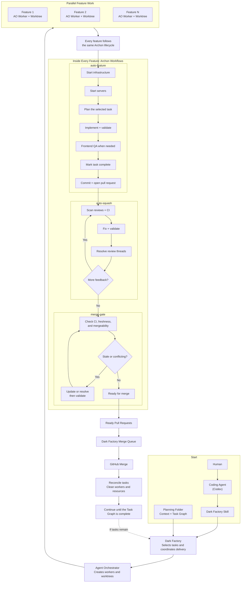

# System Flow

```mermaid
flowchart TB
    subgraph START["Start"]
        direction LR
        H["Human"] --> C["Coding Agent<br/>(Codex)"] --> S["Dark Factory Skill"]
        P["Planning Folder<br/>Context + Task Graph"]
    end

    S --> DF["Dark Factory<br/>Selects tasks and coordinates delivery"]
    P --> DF
    DF --> AO["Agent Orchestrator<br/>Creates workers and worktrees"]

    subgraph FEATURES["Parallel Feature Work"]
        direction LR
        F1["Feature 1<br/>AO Worker + Worktree"]
        F2["Feature 2<br/>AO Worker + Worktree"]
        FN["Feature N<br/>AO Worker + Worktree"]
        F1 ~~~ F2 ~~~ FN
    end

    AO --> FEATURES
    FEATURES --> LIFECYCLE["Every feature follows<br/>the same Archon lifecycle"]

    subgraph PIPELINE["Inside Every Feature: Archon Workflows"]
        direction LR

        subgraph FEATURE["auto-feature"]
            direction TB
            INFRA["Start infrastructure"]
            SERVERS["Start servers"]
            PLAN["Plan the selected task"]
            IMPLEMENT["Implement + validate"]
            QA["Frontend QA when needed"]
            ROADMAP["Mark task complete"]
            PR["Commit + open pull request"]

            INFRA --> SERVERS --> PLAN --> IMPLEMENT --> QA --> ROADMAP --> PR
        end

        subgraph REVIEW["auto-squash"]
            direction TB
            SCAN["Scan reviews + CI"]
            FIX["Fix + validate"]
            RESOLVE["Resolve review threads"]
            MORE{"More feedback?"}

            SCAN --> FIX --> RESOLVE --> MORE
            MORE -->|Yes| SCAN
        end

        subgraph GATE["merge-gate"]
            direction TB
            PREFLIGHT["Check CI, freshness,<br/>and mergeability"]
            PROBLEM{"Stale or conflicting?"}
            REPAIR["Update or resolve<br/>then validate"]
            READY["Ready for merge"]

            PREFLIGHT --> PROBLEM
            PROBLEM -->|Yes| REPAIR --> PREFLIGHT
            PROBLEM -->|No| READY
        end

        PR --> SCAN
        MORE -->|No| PREFLIGHT
    end

    LIFECYCLE --> INFRA
    READY --> PRS["Ready Pull Requests"]
    PRS --> QUEUE["Dark Factory Merge Queue"]
    QUEUE --> GH["GitHub Merge"]
    GH --> CLEAN["Reconcile tasks<br/>Clean workers and resources"]
    CLEAN --> NEXT["Continue until the Task Graph is complete"]
    NEXT -.->|"If tasks remain"| DF
```
