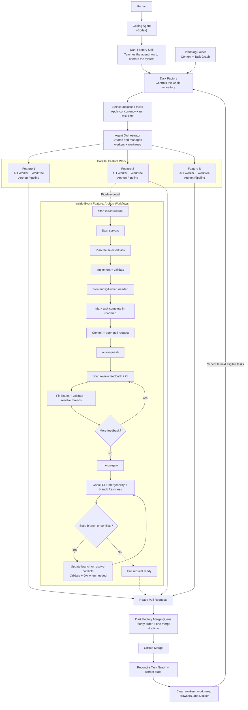

# System Flow

```mermaid
flowchart TB
    H["Human"] --> C["Coding Agent<br/>(Codex)"]
    C --> S["Dark Factory Skill<br/>Teaches the agent how to operate the system"]
    S --> DF["Dark Factory<br/>Controls the whole repository"]

    P["Planning Folder<br/>Context + Task Graph"] --> DF
    DF --> SELECT["Select unblocked tasks<br/>Apply concurrency + run task limit"]
    SELECT --> AO["Agent Orchestrator<br/>Creates and manages workers + worktrees"]

    subgraph FEATURES["Parallel Feature Work"]
        direction LR
        F1["Feature 1<br/>AO Worker + Worktree<br/>Archon Pipeline"]
        F2["Feature 2<br/>AO Worker + Worktree<br/>Archon Pipeline"]
        FN["Feature N<br/>AO Worker + Worktree<br/>Archon Pipeline"]
    end

    AO --> F1
    AO --> F2
    AO --> FN

    subgraph PIPELINE["Inside Every Feature: Archon Workflows"]
        direction TB

        INFRA["Start infrastructure"]
        INFRA --> SERVERS["Start servers"]
        SERVERS --> PLAN["Plan the selected task"]
        PLAN --> IMPLEMENT["Implement + validate"]
        IMPLEMENT --> QA["Frontend QA when needed"]
        QA --> ROADMAP["Mark task complete in roadmap"]
        ROADMAP --> PR["Commit + open pull request"]

        PR --> AS["auto-squash"]
        AS --> SCAN["Scan review feedback + CI"]
        SCAN --> FIX["Fix issues + validate + resolve threads"]
        FIX --> MORE{"More feedback?"}
        MORE -->|Yes| SCAN
        MORE -->|No| MG["merge-gate"]

        MG --> PREFLIGHT["Check CI + mergeability + branch freshness"]
        PREFLIGHT --> PROBLEM{"Stale branch or conflicts?"}
        PROBLEM -->|Yes| REPAIR["Update branch or resolve conflicts<br/>Validate + QA when needed"]
        REPAIR --> PREFLIGHT
        PROBLEM -->|No| READY["Pull request ready"]
    end

    F2 -.->|"Pipeline detail"| INFRA

    F1 --> PRS["Ready Pull Requests"]
    F2 --> PRS
    FN --> PRS
    READY -.-> PRS

    PRS --> QUEUE["Dark Factory Merge Queue<br/>Priority order + one merge at a time"]
    QUEUE --> GH["GitHub Merge"]
    GH --> SYNC["Reconcile Task Graph + worker state"]
    SYNC --> CLEAN["Clean workers, worktrees, browsers, and Docker"]
    CLEAN -->|"Schedule next eligible tasks"| DF
```
