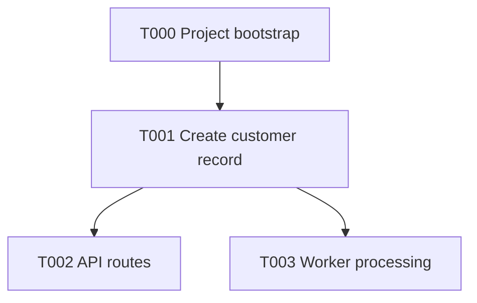

# Project Bootstrap Checklist

Bootstrap includes the manual repository prerequisites plus the first technical
project bootstrap. It may create empty apps, shared libs, health checks, docs
endpoints, and local infrastructure, but it must not implement business behavior.

> **T000 execution gate:** Complete this bootstrap with human supervision. Do
> not schedule or run T000 autonomously through Dark Factory. The bootstrap pull
> request must be merged manually, then `main` must be synced before automated
> feature work starts.

## Phase 0 — Manual Setup

These steps create the repository boundary and publish the planning folder before
technical bootstrap work begins. They can be done by a human or a focused setup
agent under human supervision, but they happen before the first feature/task
worktree.

### Step 1 — Planning Folder Ready

`planning/` defines the product shape, architecture choices, and roadmap context.

Expected planning shape:

```text
planning/
  bootstrap.md
  context/
    business/
    technical/
  roadmap/
    tasks.md
    dependencies.mmd
```

`roadmap/tasks.md` is the task/status roadmap. It should have one `Task Graph`
table with one row per task, with status, priority, task id/title, dependencies,
branch, and context references.

`Priority` is the orchestrator tie-breaker when multiple tasks are unblocked at
the same time. Lower numbers run and merge first among currently runnable tasks;
dependencies still decide what is blocked.

`roadmap/dependencies.mmd` is the Mermaid DAG for task dependencies. The
orchestrator should pick any unblocked task up to the configured
`--concurrency`; do not use execution waves or fixed wave merge order.

Example task row:

| Done | Priority | Task                            | Depends On | Branch                      | Context                                                |
| ---- | -------- | ------------------------------- | ---------- | --------------------------- | ------------------------------------------------------ |
| [ ]  | 10       | `T001` - Create customer record | T000       | `feat/t001-customer-record` | `context/domain-model.md`, `context/api-boundaries.md` |

Example dependency graph:



- [ ] Create or confirm the planning folder exists with the required structure before running bootstrap.

### Step 2 — Repository Foundation

Purpose: create the repository boundary and publish the planning folder so
automated workers can safely create task worktrees.

> First commit message: `chore: initialize repository foundation`

- [ ] Create `README.md` with project name, one-sentence description, and license.
- [ ] Create `.gitignore` and confirm `.env` is excluded.
- [ ] Create `LICENSE`.
- [ ] Create `.editorconfig`.
- [ ] Keep the planning folder in the repository root.
- [ ] Create the first commit containing only repository foundation files and the planning folder.
- [ ] Push `main` to origin.
- [ ] Confirm local `main` matches `origin/main`.

### Step 3 — Manual GitHub Repository Settings

- [ ] Branch protection on `main` — GitHub UI → Settings → Branches → `main`:
  - Rule name: `Protect main`
  - Add target → Include default branch
  - Restrict deletions
  - Require a pull request before merging (0 approvals for solo)
  - Require conversation resolution before merging
  - Require status checks to pass for the checks that exist now: `Format`, `Lint`, `Type Check`, `Test`, `Build`
  - Block force pushes
- [ ] Auto-delete head branches — GitHub UI → Settings → General → Pull Requests → check "Automatically delete head branches"

## Phase 1 — Generic Foundation

These steps do not need business context.

### Step 4 — Engineering Tooling Selection

> Choose tools that fit the repository's language, framework, and project shape.
> The named tools below are examples, not requirements. Keep every choice in this
> step so the rest of the checklist can refer to capabilities instead of vendors.

- [ ] Pin the runtime, language, package manager, and build-tool versions using the ecosystem's standard version and manifest files.
- [ ] Enable the language's strict compiler or type-checking mode, plus additional high-value safety checks that do not create framework-boundary noise. Keep production builds separate from tests and development-only files where applicable.
- [ ] Initialize package/workspace tooling for the chosen project shape. For monorepos, start with the package manager's native workspace support; add an orchestration tool only when dependency graphs, caching, or affected builds justify it.
- [ ] Configure a formatter and its ignore file (for example, Prettier) so formatting is deterministic and CI-checkable.
- [ ] Configure language-aware linting or static analysis with strict production rules and focused test/config overrides (for example, ESLint). Do not weaken production checks to accommodate test doubles or framework configuration files.
- [ ] Configure dead-code and unused-dependency detection (for example, Knip or the ecosystem equivalent).
- [ ] Select a structured logging library appropriate to the stack (for example, Pino); wire it after the app skeletons exist.
- [ ] Select persistence clients and migration tooling from the project architecture (for example, Drizzle or the framework/ecosystem equivalent); wire them with local infrastructure in Step 7.
- [ ] Select generated API documentation tooling for public HTTP entrypoints when applicable (for example, OpenAPI/Swagger); wire it while creating the app skeletons in Step 6.
- [ ] Select unit, integration, and end-to-end testing tools appropriate to the stack (for example, Vitest, Supertest, and Testcontainers); configure them after app skeletons and infrastructure exist.
- [ ] Define one repository validation command and add each applicable formatter, lint/static-analysis, compiler/type-check, test, dead-code, dependency/security-audit, and production-build check as it becomes available.
- [ ] Stop at reusable engineering foundations here. Do not generate business-specific services, routes, schemas, queues, workers, or feature libraries in this generic phase.

---

### Step 5 — Automated CI Setup

- [ ] GitHub Actions workflow (`ci.yml`): format → lint → type-check → build
- [ ] PR validation workflow (`pr-check.yml`): conventional commit title enforcement, dependency review, merge conflict detection
- [ ] Auto-assign PR author workflow (`auto-assign-pr.yml`): assigns the PR to its author on open. If the workflow writes PR metadata, use the correct GitHub event and permissions for that write path, and do not check out or execute untrusted PR code.
- [ ] CI permissions: least-privilege (`contents: read` by default; add only the write permissions a workflow actually needs)
- [ ] Dependabot for GitHub Actions (`.github/dependabot.yml` — `github-actions` ecosystem; professional default is weekly, individual side-project choice is monthly to reduce noise). If the project should also receive package dependency PRs, add the package ecosystem explicitly with the same noise policy.

## Phase 2 — Project Shape Foundation

These steps depend on the planning folder created in Step 1. They may create app/service/lib boundaries, but still must not implement feature behavior.

### Step 6 — App/Service/Lib Skeletons From Planning

> Read the planning folder, identify the initial project boundaries, then create them. The goal is a runnable project shape, not working product behavior.

- [ ] Confirm the planning folder names the initial apps/services/libs/modules.
- [ ] Confirm the backing services needed locally: database, queue/broker, cache, object storage, etc.
- [ ] Confirm the public entrypoints: REST, GraphQL, CLI, worker, scheduler, or dashboard.
- [ ] Confirm what is intentionally out of scope for bootstrap.
- [ ] Confirm the first real feature task starts in `tasks.md`, not in this bootstrap checklist.
- [ ] Generate the initial apps/services defined by the planning folder.
- [ ] Generate shared libs/modules defined by the planning folder.
- [ ] Initialize framework-specific app tooling only for the apps/services approved by the planning folder.
- [ ] Add bootstrap entrypoints and empty module shells.
- [ ] Add health endpoint only if the selected framework/app shape needs it for local verification.
- [ ] For public HTTP entrypoints, wire the API documentation capability selected in Step 4.
- [ ] Expose documented UI and machine-readable API-spec endpoints using the project's conventions.
- [ ] Document bootstrap-level endpoints only; do not design feature DTOs or business API contracts here.
- [ ] Do not implement auth flows, job handlers, database tables, queues, product logic, or feature behavior.

---

### Step 7 — Local Development Infrastructure

- [ ] `docker-compose.yml` (database, cache, queue — whatever backing services you need)
- [ ] `.env.example` (documented, every variable explained with comments)
- [ ] Wire the persistence connection and migration tooling selected in Step 4.
- [ ] Keep environment defaults consistent across `.env.example`, Docker Compose defaults, app config fallbacks, migration config, tests, and CI dummy env. A clean clone should work without hidden local `.env` values.
- [ ] Backing-service clients/pools must handle idle/runtime errors, log failures, and close cleanly during shutdown.
- [ ] **Worktree isolation** — parallel branches need isolated infrastructure. Without this, worktrees share one database and collide on ports.
  - Install [`worktree-compose`](https://www.worktree-compose.com/) globally (`npm i -g worktree-compose`). Usage: `wtc list` to see worktrees + ports, `wtc start <index>` to spin up isolated infra, `wtc stop <index>` to tear down.
  - Do **not** set hardcoded `container_name` values in Compose files. Let Docker Compose namespace containers per project/worktree.
  - Parameterize **all** host ports in `docker-compose.yml` with env var defaults. No hardcoded host ports.
  - Prefer project-specific default **host** ports for common services instead of the service's standard port (e.g. `${POSTGRES_PORT:-15432}:5432`, `${REDIS_PORT:-16379}:6379`, `${GATEWAY_PORT:-18000}:80`).
  - Keep container ports standard; change only the host-side port unless the container image requires otherwise.
  - Bind local-only infrastructure ports to `127.0.0.1` unless another machine must reach them (e.g. `127.0.0.1:${POSTGRES_PORT:-15432}:5432`).
  - Make `.env.example` connection URLs match the default host ports exactly.
  - Add `.wtcrc.json` with `envOverrides` to rewrite connection strings (`DATABASE_URL`, `REDIS_URL`, etc.) using allocated ports — `wtc` offsets the port variables but can't parse URLs automatically.
  - Keep `wtc` URL overrides port-derived only. Do not hardcode usernames, passwords, tokens, or credential-bearing URLs in `.wtcrc.json`, `.env.example`, Docker Compose, app config fallbacks, migration config, tests, or CI dummy env. For simple local Mongo tasks, prefer a no-auth local URI such as `mongodb://127.0.0.1:${MONGODB_PORT}/app?directConnection=true`.
  - Treat `wtc` setup as part of the bootstrap, not an optional afterthought: commit the required support files up front (`.wtcrc.json`, compatible `docker-compose*.yml`, and any generated/synced paths your app needs).
  - Make sure Docker build contexts, Dockerfiles, and mounted paths still work from a git worktree checkout after `wtc` syncs files from the source worktree.
  - Full-stack isolation: frontend dev ports, backend dev ports, proxy targets, callback URLs, and internal service URLs must resolve per worktree too. Infra isolation alone is not enough if local app processes still collide on shared localhost ports.
  - Worktree runbook: run migrations and seeds against the worktree-local `.env`, use the worktree-local app URL for browser QA, and document how to stop stale background dev processes from previous runs.

---

### Step 8 — Observability Foundation

- [ ] Wire the structured logging library selected in Step 4 using a machine-readable format.
- [ ] Add request correlation IDs where applicable. Normalize and validate inbound correlation values; replace empty, malformed, or multi-value inputs instead of trusting them blindly.
- [ ] Add health/readiness endpoints appropriate to the selected app and infrastructure shape.
- [ ] Add graceful shutdown handling so servers, workers, and backing-service clients close cleanly.

---

### Step 9 — Testing Foundation

> Before implementing this step, check the current official documentation for
> the testing tools selected in Step 4. Use the current APIs to create the local
> exemplary unit, integration, and end-to-end patterns.

- [ ] Configure unit, integration, and end-to-end test layers that apply to this project.
- [ ] Add HTTP-level end-to-end testing for public HTTP entrypoints where applicable.
- [ ] Configure real backing-service integration tests where applicable.
- [ ] Add one exemplary unit test for pure service or handler logic where applicable.
- [ ] Add one exemplary integration test against a real backing service where applicable.
- [ ] Add one exemplary end-to-end test against a booted application where applicable.
- [ ] Configure coverage with an initial 50% floor that can increase over time.
- [ ] Ensure project-level build targets pass for generated apps and libraries, not only the repository-root build.
- [ ] Complete the repository validation command from Step 4 so it runs every applicable quality, test, security, and production-build check.

---

### Step 10 — Developer Experience

- [ ] `AGENTS.md` — Codex agent instructions for this repo. Check current official Codex guidance for instruction-file conventions, then inspect this repo's scripts, app/lib layout, Docker services, env files, tests, and bootstrap decisions. Include how to run dev, validation commands, test conventions, banned behaviors, architecture map, service ownership, env/service gotchas, and common workflows. Keep it concise and less than 200 lines.
- [ ] `CLAUDE.md` — create this file containing only `@AGENTS.md`. Claude Code's `@` import syntax loads the referenced file as the actual instructions content. This makes `AGENTS.md` the single source of truth: Claude Code reads it via the import, while every other coding agent (Codex, Cursor, Copilot, Gemini CLI, Windsurf) reads it directly. One file to maintain, all tools stay in sync automatically.
- [ ] Verify every command documented in `AGENTS.md` exists in the Makefile, package scripts, or the repo's chosen task runner.
- [ ] `Makefile` or task runner — expose core developer workflows, not every package script. Add memorable commands a developer actually uses, such as `make setup`, `make infra`, `make dev`, `make web`, `make check`, and `make validate`. Only include commands that are wired to real repo behavior.

---

### Step 11 — Security Baseline

- [ ] **`.gitignore` audit:** Verify `.env`, `*.pem`, `*.key`, `*.p12`, `secrets/` are excluded. Run `git status` on a clean checkout — nothing sensitive should appear.
- [ ] **Environment variable hygiene:** `.env.example` documents every variable with comments, uses obviously fake placeholders (`changeme`, `your-db-password`, empty string), and contains no real credentials. CI workflow files must use dummy values only and must not print secrets.
- [ ] **Dependency license policy:** Deny GPL-3.0 and AGPL-3.0 via `actions/dependency-review-action` in `pr-check.yml`. Keep vulnerability auditing in the full CI pipeline step, not here.
- [ ] **Pre-commit secret scanning:** Blocks secrets from entering git history.
  - Install [gitleaks](https://github.com/gitleaks/gitleaks/releases) on each dev machine.
  - Add `lefthook` using the chosen package manager, with a `pre-commit` job running `gitleaks protect --staged --redact`.
  - The hook must check that `gitleaks` is installed and fail with a clear install message when missing.
  - Wire hook installation through the ecosystem's standard install/setup lifecycle so every developer gets the hook, while preserving any existing global hook policy.

---

### Step 12 — Full CI Pipeline

- [ ] Add test job to CI workflow for the test layers that exist locally (unit, integration, e2e, or the repo's single `test` script)
- [ ] Add the repository's format-check command to CI before lint/typecheck so formatting drift cannot bypass CI.
- [ ] Run integration/e2e tests with the required CI backing services for this project (for example: database, cache, queue, broker, object storage)
- [ ] Add CI caching where useful (package manager store, build-tool cache, lint cache, or compiler incremental cache if enabled)
- [ ] Concurrency groups (cancel stale runs on same branch)
- [ ] Timeout limits per job (prevent runaway builds)
- [ ] Run the ecosystem's dependency vulnerability audit in its own `Security Audit` job, parallel to lint/typecheck/test.

### Step 13 — Post-Bootstrap Audit

> Agents generate files with stale dependency versions (LLM training cutoff) and hallucinated GitHub Actions SHAs. This step fixes both, then validates everything in one pass.

- [ ] Use the chosen package manager to update direct workspace dependencies to their intended current versions.
- [ ] Regenerate and commit the dependency lockfile after version changes.
- [ ] Pin GitHub Actions to SHA — **never write SHAs by hand; AI models hallucinate them.** Use [pinact](https://github.com/suzuki-shunsuke/pinact) to resolve and verify. Install or refresh it using the official instructions for the current operating system and architecture, then run:

  ```bash
  pinact --version

  # Write workflows with version tags (@v6), then pin them to real SHAs
  GITHUB_TOKEN=$(gh auth token) pinact run

  # Verify existing SHAs match their version annotations
  GITHUB_TOKEN=$(gh auth token) pinact run -verify

  # Update all actions to latest versions + re-pin
  GITHUB_TOKEN=$(gh auth token) pinact run -update
  ```

  > `GITHUB_TOKEN` is required — without it pinact hits GitHub's unauthenticated rate limit and times out.

- [ ] Run the completed repository validation command from Step 9 and confirm nothing broke.
- [ ] Update `README.md` — flesh out the placeholder from Step 2: accurate setup steps, final project structure, environment variables, and any gotchas discovered during development.

---

### Step 14 — Local Smoke Test

> Final runtime check before opening the bootstrap PR. This proves the project can actually start, not only compile.

- [ ] Start local services using the project's documented command.
- [ ] Confirm required services are healthy or ready.
- [ ] Run migrations if migration files exist or the app requires them to boot.
- [ ] Run the full local validation command.
- [ ] Start each app/process/worker needed for the bootstrap.
- [ ] Check documented health/docs endpoints for HTTP apps.
- [ ] Exercise one minimal runtime path per entrypoint, without testing feature behavior.
- [ ] Stop local services.
- [ ] Confirm no stale containers, ports, or background processes remain.

### Step 15 — First Pull Request

- [ ] First PR — branch `chore/t000-project-bootstrap`
- [ ] PR title: `chore: bootstrap project`
- [ ] PR description: summarize bootstrap scope, list validation evidence, and note that business behavior is intentionally out of scope.
- [ ] Keep the bootstrap in one PR with clean commits:
  - `chore: configure workspace and quality gates` — runtime/language config, package/workspace metadata, formatting, lint/static analysis, dead-code checks, validation command, and CI basics.
  - `chore: bootstrap project runtime` — app/service/lib skeletons, local infrastructure, environment contract, persistence/migrations, observability, health/docs endpoints, tests, security baseline, task runner, agent instructions, and final smoke/review fixes.
- [ ] Mark the T000 row as complete (`[x]`) in `planning/roadmap/tasks.md` as part of this pull request.
- [ ] Review the T000 implementation with human supervision.
- [ ] Merge the T000 pull request manually after its required checks pass.
- [ ] Sync local `main` with `origin/main`.
- [ ] Register the project with Dark Factory using the planning folder.
- [ ] Run a Dark Factory dry-run and confirm T000 is complete and only eligible post-bootstrap tasks are runnable.
